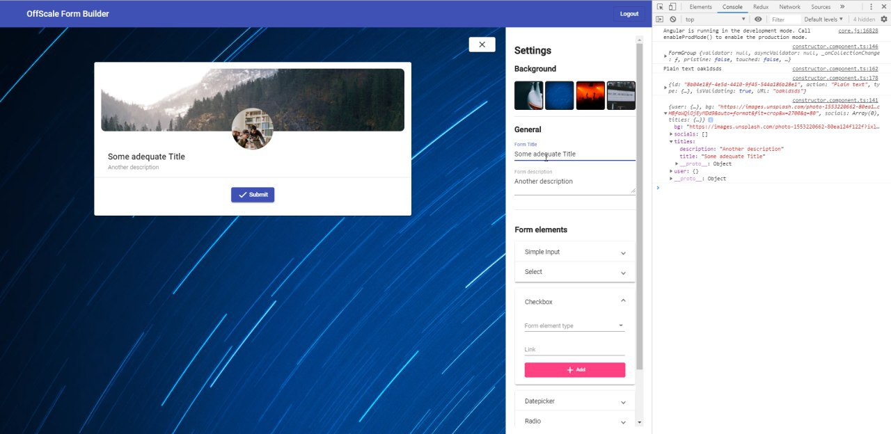

# OffScale-Form-Builder-Spring-Hack
“The main thing I'm trying to show here is a simple, responsive, web-based interface that allows you to extend applications, by writing your own workflow (form wizard), schema (SQL), and routes (OpenAPI).” Samuel Marks, CTO

# Structure

<ol type="1" style="font-size: x-large;">
  <li> <a href="#about">About project</a>
  <li> <a href="#solution">Solution</a>
<ol type="a" style="font-size: large;">
  <li> <a href="#frontend">Frontend</a>
</ol>
  <li> <a href="#installation">Installation</a>
  <li> <a href="#sql&json">SQL&JSON</a>
  <li> <a href="#finally">Finally</a>
  <li> <a href="#team">Team</a>
</ol>

# About
We are the **IBI SOLUTIONS** team and we solved the task of **creating tools for designing and creating web applications with an intuitive drag-and-drop interface**.

We present the project Startblock - web application without a server (client side)

We solved the following problem - **creating a web application without a server, consisting of 3 parts: SQL designer, OpenApi designer, Form Builder**

Video demonstration of our prototype: https://youtu.be/9YR9obWRUjM

# Solution

Our solution is the implementation of a web application that allows you to create forms. The interaction of customers of our service is carried out through a web application.

Our product consists of the following parts:

* <a href="https://github.com/Hennessy811/OffScale-Form-Builder-Spring-Hack/blob/master/sql%26yaml/localstorage.js">Local storage </a>;

* <a href="https://github.com/Hennessy811/OffScale-Form-Builder-Spring-Hack/blob/master/sql%26yaml/sql_yaml_generator.js">OpenApi designer generating YAML</a>;

* <a href="https://github.com/Hennessy811/OffScale-Form-Builder-Spring-Hack/tree/master/src">Angular web application for creating forms</a>;

Script Option:
1. Create a form and json generic (format thrown off above)
2. Call save_at_local_storage (a_key, a_text), in a_key we transfer the name of the form <FORMNAME>, to a_text received json
3. Generate sql for a specific form:
     - call generateSQL (a_form_json), instead of a_form_json, we pass get_from_local_storage (<FORMNAME>) - our saved json
4. Save the resulting sql code in localstorage (again, call save_at_local_storage (a_key, a_text), only the key is different already)
5. Then we can pull out both json and sql, we can delete some by key (remove_key_from_local_storage (a_key)), or delete everything altogether by cleaning local storage (clear_local_storage ())
  
 Video demonstration of our prototype: https://youtu.be/9YR9obWRUjM

Next we look at the technical implementation of our project.

# Frontend

When you start the site, you will see the following interface:

A detailed description of how to run this solution can be found here. - <a href="#installation">“Installation”</a> section.

In the form creator, we will be able to construct a form and fill it with data.
We can create cards and fill it with the necessary elements.
All data and form information is converted to a JSON file.
After that, JSON is converted and creates a SQL table with the necessary data in the correct format.
In the future we plan to add the conversion to the YAML file and transfer to the open API designer.
Subsequently, these files are transferred and stored locally and can be used by services.

# Installation
# SetquestRx

This project was generated with [Angular CLI](https://github.com/angular/angular-cli) version 7.3.5.

## Development server

Run `ng serve` for a dev server. Navigate to `http://localhost:4200/`. The app will automatically reload if you change any of the source files.

## Code scaffolding

Run `ng generate component component-name` to generate a new component. You can also use `ng generate directive|pipe|service|class|guard|interface|enum|module`.

## Build

Run `ng build` to build the project. The build artifacts will be stored in the `dist/` directory. Use the `--prod` flag for a production build.

## Running unit tests

Run `ng test` to execute the unit tests via [Karma](https://karma-runner.github.io).

## Running end-to-end tests

Run `ng e2e` to execute the end-to-end tests via [Protractor](http://www.protractortest.org/).

# SQL&JSON

The source code applies converting SQL-code to JSON-format and vice versa.  
It supports next JSON-format:  
<code>{ 
 "database" : "MySQL",
 "tablename" : "testtable", 
 "fields" : [{"name": "id", "type" : "integer", "autoinc" : 1, "nullable" : 0}],
 "primary_key" : "id",
 "foreign_keys" : [{"name" : "mail", "references": "mails(mail)"}]
}</code> 

You can test it running test.html file in sql&yaml directory.  
Test applies: 
1. Convert MySQL-code to JSON
2. Convert JSON to MySQL-code
3. Save results at browser's local storage
4. Load result from browser's local storage
5. Delete result from browser's local storage
6. Clean local storage

# Finally

Video demonstration of our prototype: https://youtu.be/9YR9obWRUjM 

During the hackathon:
ОПИСАНИЕ ЗАДАЧ!
- Connect open API with SQL designer
- We created a frontend in the form of a form builder, in which you can create various elements and convert them to JSON
- We created a SQL designer that is changed using the database and incoming JSON files.
- Created a local repository for storing Json, SQL schemas, YAML files

Solved problems:
- Connect open API with SQL designer
- Get rid of local data storage

Refinement options:
- We will create a connection of our system with open api and the publication of the created files on this system. This will be a complete, complete product and a great improvement to our existing MVP.

# Team

- Ivan Fedorov - fedorov@yandex.ru, was engaged in a database, presentation
- Kanzeparov Ruslan - kanzeparov@yandex.ru, was engaged in the presentation and database
- Dmitry Malakhov - malakhov@yandex.ru, was engaged in the front
- Anton Pecherkin - aa.pecherkin@yandex.ru, was engaged in the presentation

